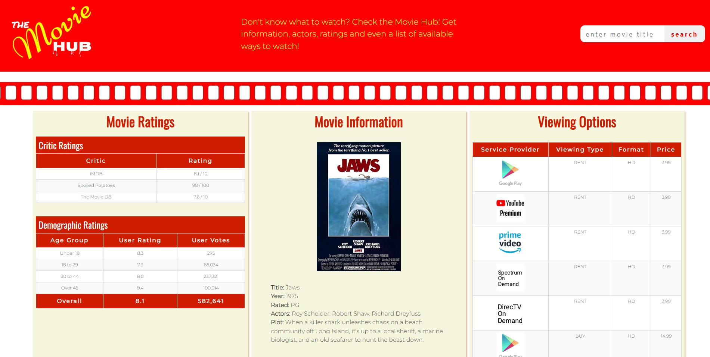
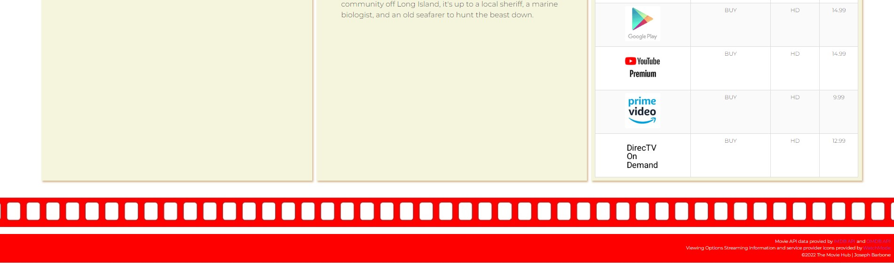
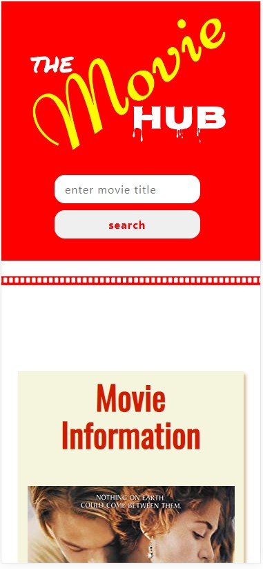
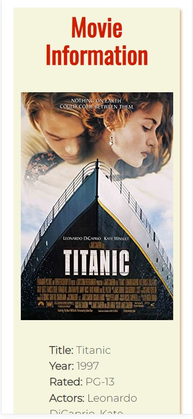
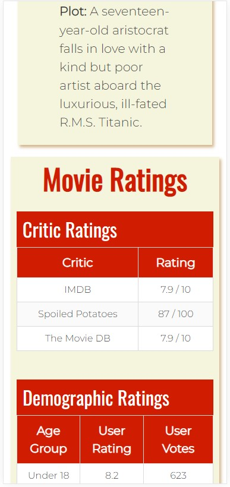
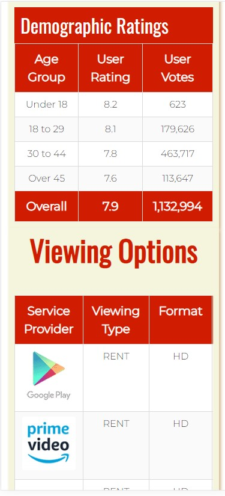

# The Movie Hub (movie-app)
## Project #1
Project #1 required us to work in a group. Our group was Susan, James, Raf and myself. I contributed to the JavaScript and APIs for the group project as well as minor fixes on the HTML/CSS files.

Since I am planning on doing freelance web development after this course, I need to get experience in all aspects of the development process. This repo is the result. All aspects of this site have been completed by me.

## Screenshots
Main Desktop Example

Main Deskto Example 2

Main Mobile Example 1   

Main Mobile Example 2  

Main Mobile Example 3  

Main Mobile Example 4  

## Live Site
[The Movie Hub (Movie-App Live Site)](https://joebarbone.github.io/movie-app/)

## Summary/Languages
This project was challenging due to the fact that we were required to learn a new framework. The framework we chose was Bulma. I like some aspects of Bulma but prefer Bootstrap in others. The ease of "columns" and "column" to create the grid is nice within Bulma, but overall I think I prefer using "container", "row" and "col" in Bootstrap. It may be because I have more experience with Bootstrap, but for me, Bootstrap definitely handles responsiveness better. Again, I'm sure this was due to my lack of knowledge using Bulma. As I continue to use it, I will most likely get as familiar with it as I am using Bootstrap.

The following languages/technologies were used in the creation of this project:
* HTML
* CSS
* Bulma Framework
* JavaScript
* APIs
* LocalStorage within browser
* Logo Shop iPhone App

## Acknowledgements
[OMDB API](https://omdbapi.com) - Provides Poster, Title, Year, Rated, Actors, Plot  
[IMDB-API](https://imdb-api.com) - Provides critic ratings and demographic ratings  
[WatchMode API](https://api.watchmode.com) - Provides streaming availability data  

